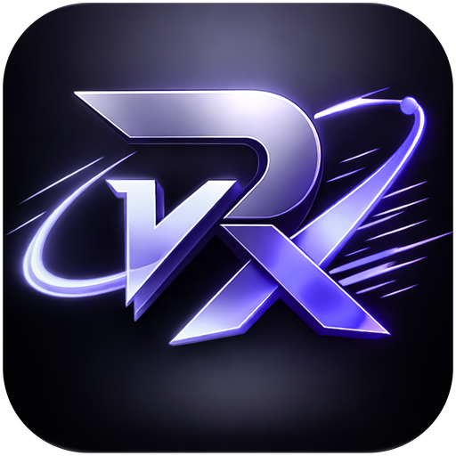
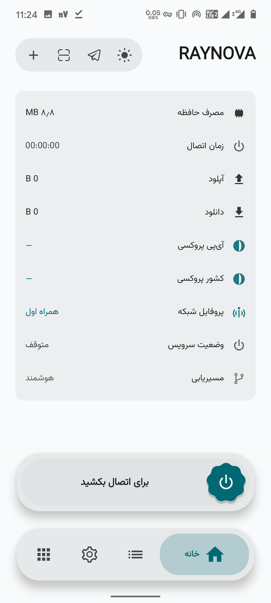
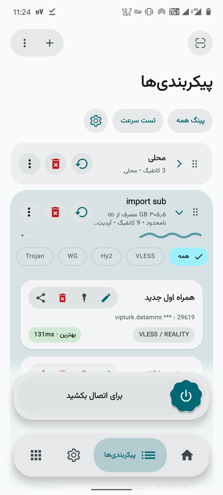
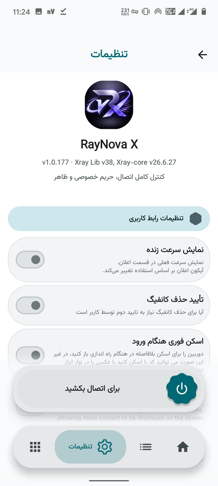
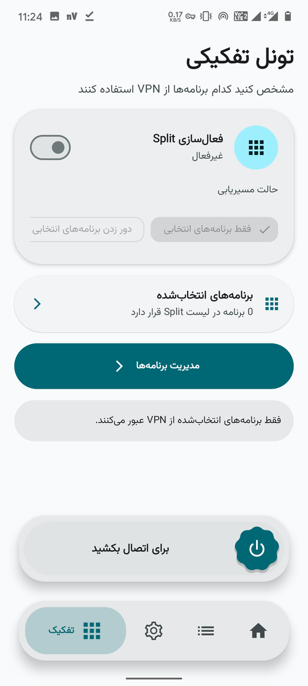

<div align="center">
  
  <h1>⚡ RayNova X — دانلود</h1>
  <p><b>کلاینت اندروید فارسی برای Xray • sing-box • Psiphon</b></p>
  <p>
    <a href="https://github.com/Mmrknight123/Xraynova-APK/releases/latest"></a>
    
    
    
    <a href="https://t.me/Raiv2mmr"></a>
    
  </p>
  <p><b>آخرین نسخه: <code>1.0.177</code></b> (versionCode <code>10198</code>) · منتشرشده در 2026-10-07</p>
</div>

<div dir="rtl">

سورس RayNova X خصوصی است؛ این صفحه فقط برای **دانلود نسخه‌های ساخته‌شده** است.

## ⬇️ دانلود

| فایل | مناسب برای | لینک همیشگی (همیشه آخرین نسخه) |
| --- | --- | --- |
| ⭐ **arm64-v8a** (پیشنهادی) | تقریباً همه‌ی گوشی‌ها و تبلت‌های امروزی | [⬇️ دانلود](https://github.com/Mmrknight123/Xraynova-APK/releases/latest/download/RayNovaX-arm64-v8a.apk) |
| armeabi-v7a | گوشی‌های ۳۲بیتی قدیمی | [⬇️ دانلود](https://github.com/Mmrknight123/Xraynova-APK/releases/latest/download/RayNovaX-armeabi-v7a.apk) |
| x86_64 | شبیه‌سازها و کروم‌بوک‌های اینتلی | [⬇️ دانلود](https://github.com/Mmrknight123/Xraynova-APK/releases/latest/download/RayNovaX-x86_64.apk) |
| x86 | شبیه‌سازهای ۳۲بیتی | [⬇️ دانلود](https://github.com/Mmrknight123/Xraynova-APK/releases/latest/download/RayNovaX-x86.apk) |
| universal | همه‌ی معماری‌ها در یک فایل (حجیم) | [⬇️ دانلود](https://github.com/Mmrknight123/Xraynova-APK/releases/latest/download/RayNovaX-universal.apk) |
| SHA256SUMS.txt | بررسی سلامت فایل‌ها | [⬇️ دانلود](https://github.com/Mmrknight123/Xraynova-APK/releases/latest/download/SHA256SUMS.txt) |

> اگر معماری گوشی‌تان را نمی‌دانید، فایل **arm64-v8a** را بردارید؛ با احتمال بالا درست است.

فایل‌های نسخه‌دار این نسخه (`RayNovaX_1.0.177_arm64-v8a.apk` و…) هم در [صفحه‌ی ریلیز](https://github.com/Mmrknight123/Xraynova-APK/releases/latest) هستند.

## ✨ چرا RayNova X؟

* 🚀 **سه هسته در یک اپ:** Xray + sing-box + Psiphon زنجیره‌ای برای عبور از فیلترینگ شدید
* 🇮🇷 **رابط کاملاً فارسی و راست‌چین** با Material 3
* 🔄 **آپدیت بی‌دردسر:** نسخه‌های بعدی روی همین نسخه نصب می‌شوند، بدون حذف اپ و بدون پاک شدن کانفیگ‌ها
* ✅ **قابل راستی‌آزمایی:** هر ریلیز همراه `SHA256SUMS.txt` منتشر می‌شود

## 📱 نمایی از برنامه

<div align="center">
  <table>
    <tr>
      <td align="center"><br/><b>🏠 خانه</b></td>
      <td align="center"><br/><b>📋 پیکربندی‌ها</b></td>
    </tr>
    <tr>
      <td align="center"><br/><b>⚙️ تنظیمات</b></td>
      <td align="center"><br/><b>🔀 تونل تفکیکی</b></td>
    </tr>
  </table>
</div>

## 📦 نصب

۱. فایل APK را دانلود کنید.
۲. اگر اندروید هشدار داد، اجازه‌ی «نصب از منابع نامشخص» را برای مرورگر/فایل‌منیجر بدهید.
۳. فایل را باز کنید و نصب را تأیید کنید.
۴. نسخه‌های بعدی با **همان کلید امضا** منتشر می‌شوند و روی همین نسخه به‌صورت آپدیت نصب می‌شوند؛ نیازی به حذف اپ نیست.

<details>
<summary>✅ بررسی سلامت دانلود (اختیاری ولی توصیه‌شده)</summary>

```bash
sha256sum -c SHA256SUMS.txt
```

</details>

## 🗂 همه‌ی نسخه‌ها

* [فهرست کامل نسخه‌ها](https://github.com/Mmrknight123/Xraynova-APK/releases)
* آخرین بیلد: [مشاهده در گیت‌هاب](https://github.com/Mmrknight123/Xraynova/actions/runs/37629657601)

## ❓ سوالات پرتکرار

<details>
<summary><b>با نصب نسخه‌ی جدید، کانفیگ‌ها و اشتراک‌هایم پاک می‌شود؟</b></summary>

نه. همه‌ی نسخه‌ها با **همان کلید امضا** منتشر می‌شوند، پس نسخه‌ی جدید دقیقاً روی قبلی آپدیت می‌شود؛ کانفیگ‌ها، اشتراک‌ها و تنظیمات سر جایشان می‌مانند. فقط کافی است APK جدید را نصب کنید.

</details>

<details>
<summary><b>کدام فایل را دانلود کنم؟</b></summary>

در ۹۹٪ موارد **`arm64-v8a`** — مال تقریباً همه‌ی گوشی‌های چند سال اخیر است. اگر گوشی خیلی قدیمی (۳۲بیتی) دارید `armeabi-v7a`، و اگر شبیه‌ساز/کروم‌بوک اینتلی دارید نسخه‌ی `x86_64` را بردارید.

</details>

<details>
<summary><b>اندروید اجازه‌ی نصب نمی‌دهد («نصب از منابع ناشناس»)؟</b></summary>

طبیعی است؛ چون اپ از گوگل‌پلی نصب نمی‌شود. در همان پیام هشدار، اجازه را برای مرورگر/فایل‌منیجر فعال کنید و دوباره فایل را باز کنید.

</details>

<details>
<summary><b>نسخه‌ی iOS / ویندوز / مک هم هست؟</b></summary>

فعلاً فقط **اندروید (۷ به بالا)**. اگر پلتفرم دیگری اضافه شد، همین‌جا اعلام می‌شود.

</details>

## 📄 لایسنس و سورس

RayNova X یک نسخه‌ی تغییر‌یافته از [v2rayNG](https://github.com/2dust/v2rayNG) است و تحت **GPL-3.0** منتشر می‌شود. سورس این پروژه در مخزن خصوصی نگه‌داری می‌شود؛ **سورس متناظر همین بیلد بنا به درخواست در اختیار شما قرار می‌گیرد** (بند ۶b لایسنس GPLv3) — برای دریافت، از راه ارتباطی زیر پیام بدهید:

* تلگرام: [Raiv2mmr](https://t.me/Raiv2mmr)

متن کامل لایسنس و لایسنس‌های اجزای ثالث (v2rayNG، Xray، sing-box، Psiphon، hev-socks5-tunnel، فونت وزیرمتن) همراه سورس درخواستی ارائه می‌شود.

</div>

<div align="center">
  <sub>⚡ RayNova X · ساخته‌شده با 💜 برای اینترنت آزاد · Made with 💜 for a free internet</sub>
</div>
